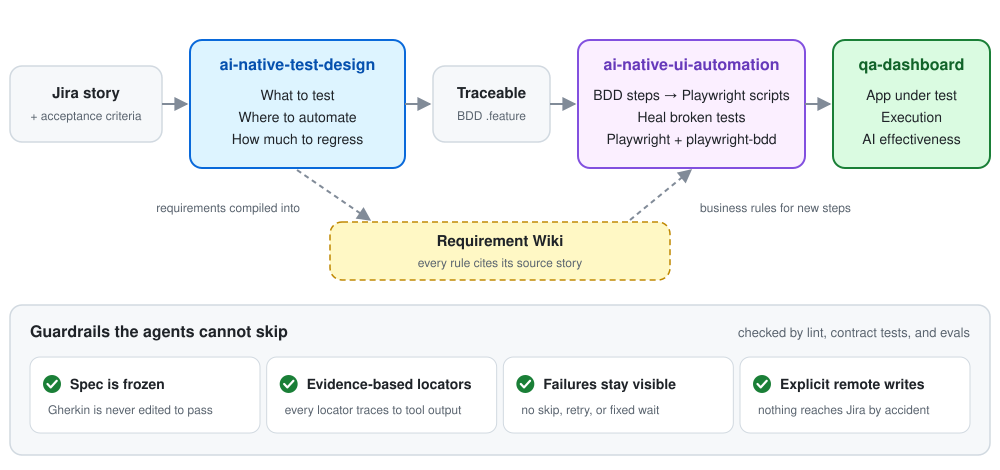

# Agentic QA Workflow

**Testing at the speed of AI coding.**

- **Testing is now the bottleneck.** AI makes code faster to write. If testing
  stays slow, delivery stays slow.
- **Review cannot find all problems.** AI writes more code than people can
  review line by line. Tests must find the problems that review does not find.
- **This workflow makes verification faster and stricter.** Agents design tests
  from each story, implement them in Playwright, and repair them when the app
  changes. Each test traces back to the requirement text.

<picture>
  <source media="(prefers-color-scheme: dark)" srcset="assets/workflow-dark.svg">
  
</picture>

## Key outcomes

| Task | Manual | With the workflow | Faster |
|---|---|---|---|
| Design functional tests for one story | ~1 h | ~15 min: agent draft in [3 min](https://github.com/DerrickDeng/ai-native-test-design/blob/main/docs/evaluation/results.md), then 10 min of review and fixes | **~4×** |
| Implement a BDD regression scenario of ~15 steps | ~1 day | ~30 min, with review and fixes | **~16×** |
| Repair a test that fails after an app change | ~half a day | ~30 min: agent fix in 20 min, then 10 min of review and fixes | **~8×** |
| Sync one story with Jira: fetch the requirement, upload the BDD, and create the Zephyr tests | ~1 h | ~5 min with the `jira-sync` CLI | **~12×** |

## Technical Details

### 1. Test Design · [ai-native-test-design](https://github.com/DerrickDeng/ai-native-test-design)

| Skill | What it does | Benefit |
|---|---|---|
| [`functional-test-design`](https://github.com/DerrickDeng/ai-native-test-design/tree/main/skills/functional-test-design) | Splits each acceptance criterion into small claims, designs test data that can expose a wrong result, and writes the `.feature` file. An independent review checks the design. | No hidden rule is lost. Unclear requirements become open questions, not guesses. |
| [`automation-coverage-analysis`](https://github.com/DerrickDeng/ai-native-test-design/tree/main/skills/automation-coverage-analysis) | Recommends the cheapest reliable layer for each behavior: unit, integration, or end-to-end. It keeps the recommendation apart from the evidence of existing tests. | Fewer slow end-to-end tests. No false coverage claims. |
| [`regression-suite-design`](https://github.com/DerrickDeng/ai-native-test-design/tree/main/skills/regression-suite-design) | Maps all functional tests of a module, selects a compact regression suite by business risk, and writes a Jira coverage table for the product owner. | A small suite that covers the key risks. Each choice has a reason. |
| [`jira-sync` CLI](https://github.com/DerrickDeng/ai-native-test-design/blob/main/bin/jira-sync) | Fetches requirement snapshots, lints features, and syncs to Jira or Zephyr only on an explicit command. The lint checks that each quote in the coverage trace is in the requirement. | Mechanical work stays deterministic. Nothing writes to Jira by accident. |
| [Requirement wiki](https://github.com/DerrickDeng/ai-native-test-design/tree/main/wiki) | Compiles the stories into topic pages with OpenViking. Each rule links to its source story. | Agents find business rules across stories, and can check that the source is current. |

The same skills run in Claude Code, Codex, and Gemini CLI. A check keeps the
three copies the same.

### 2. UI Automation · [ai-native-ui-automation](https://github.com/DerrickDeng/ai-native-ui-automation)

| Skill | What it does | Benefit |
|---|---|---|
| [`playwright-bdd-step-implementor`](https://github.com/DerrickDeng/ai-native-ui-automation/tree/main/.claude/skills/playwright-bdd-step-implementor) | Implements the missing steps of an authored scenario. The test runner stops at the missing step, and **Playwright CLI** reads the live page. Each locator comes from CLI output or `generate-locator`. | Code that follows the framework rules, with locators from real browser evidence. |
| [`playwright-bdd-test-healer`](https://github.com/DerrickDeng/ai-native-ui-automation/tree/main/.claude/skills/playwright-bdd-test-healer) | Repairs a test that passed before and now fails. It reads the failure report, then the failed run's trace with the **Playwright trace CLI**. It opens a live debug session only when the trace is not enough. | Fixes go into Page Objects. No skip, retry, or fixed wait hides a real failure. |
| [`requirement-context-retrieval`](https://github.com/DerrickDeng/ai-native-ui-automation/tree/main/.claude/skills/requirement-context-retrieval) | Searches the requirement wiki when a step needs a business rule, and checks that the cited story is current. | The agent uses the latest requirement. It reports a conflict between the page and the requirement. |

**Rules that shape the agent's output.** `CLAUDE.md` is a short map that the
agent reads first. It points to `CodeRules.md`, which has 92 numbered rules.
ESLint and TypeScript enforce the rules that a machine can check, and 3 rules
fail at runtime so that no one can skip them. Contract tests check that each
skill still states the key rules.

### 3. Skill Evaluation

**Skills are tested like code.** Each skill has golden tasks with written
checks. A grader reviews each run against the checks. The tasks run again after
each skill change to find regressions.

**A self-built app under test.** The evals run against
[QA Dashboard](https://github.com/DerrickDeng/qa-dashboard), an app built for
this workflow. Its source is outside the agent's repository, so the agent cannot
read the answers. It is a live app, so the evals see real behavior: the first
eval run found a real filter race in the dashboard. The dashboard also measures
the value of agents in daily use: adoption, edits before adoption, and accuracy
against reviewed tests.

**With and without the skill.** Both configurations work in the same
repository, with the same rules files and lint. The difference shows what the
skill adds. The samples are small, so the results show passed checks, not
success rates.

| Skill | Without the skill | With the skill | Sample |
|---|---|---|---|
| [Functional test design](https://github.com/DerrickDeng/ai-native-test-design/blob/main/docs/evaluation/results.md#functional-test-design-with-and-without-the-skill) | 141 / 165 | **159 / 165** | 4 tasks × 3 runs |
| [Step implementor](https://github.com/DerrickDeng/ai-native-ui-automation/blob/main/docs/evaluation/results.md#playwright-bdd-step-implementor-with-and-without-the-skill) | 13 / 36 | **34 / 36** | 2 tasks × 1 run |
| [Test healer](https://github.com/DerrickDeng/ai-native-ui-automation/blob/main/docs/evaluation/results.md#playwright-bdd-test-healer) | 8 / 15 | **13 / 15** | 1 task × 1 run |

Deterministic gates run on each change: 66 CLI and lint tests, and 42
framework and skill contract tests.
